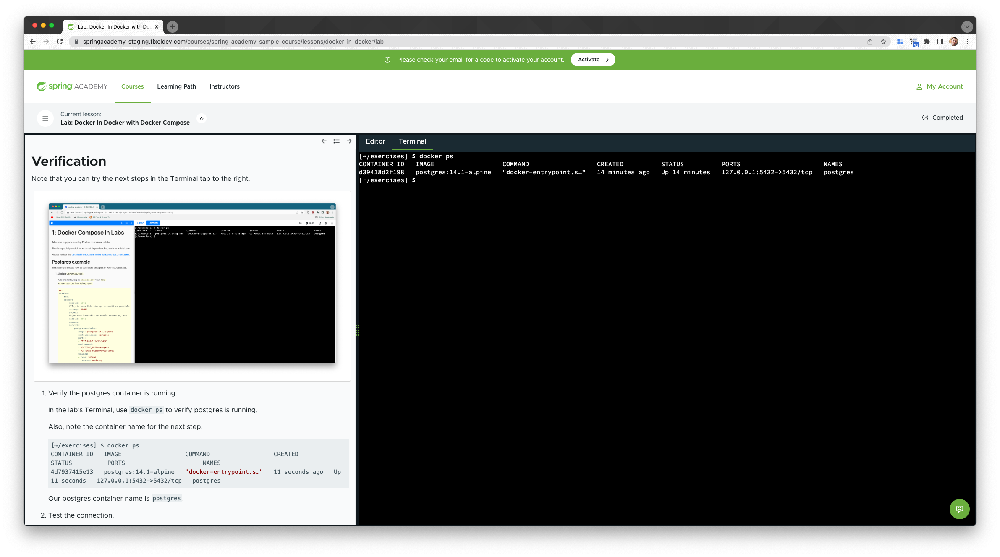

Educates supports running Docker containers in labs.

This is especially useful for external dependencies, such as a database.

Please review the [detailed instructions in the Educates documentation](https://docs.educates.dev/custom-resources/workshop-definition.html?highlight=compose#enabling-ability-to-use-docker).

## Postgres example

This example shows how to configure postgres in your Educates lab.

1. Update `workshop.yaml`.

   Add the following to `session.env` your `lab-xyz/resources/workshop.yaml`

   ```yaml
   spec:
     applications:
       session:
         docker:
           enabled: true
           storage: 500Mi
           socket:
             # you must have this to enable docker ps, etc.
             enabled: true
           compose:
             services:
               postgres-workshop:
                 image: postgres:14.1-alpine
                 container_name: postgres
                 ports:
                   - "127.0.0.1:5432:5432"
                 environment:
                   - POSTGRES_USER=postgres
                   - POSTGRES_PASSWORD=postgres
                 volumes:
                   - type: volume
                     source: workshop
                     target: /mnt
   ```

1. Deploy the workshop.

   Deploy the workshop locally using `make`.

   ```bash
   make
   ```

1. Access the lab.

   Get the training portal URL and access the lab.

   ```bash
   > kubectl get trainingportal

   kubectl get trainingportal
   NAME             URL                                             PORTALPASSWORD   ADMINUSERNAME   ADMINPASSWORD            STATUS    MESSAGE
   spring-academy   http://spring-academy-ui.192.168.0.196.nip.io                    educates        GenderatedPasswordHere   Running
   ```

   Note your URL might be different!

## Verification

Note that you can try the next steps in the Terminal tab to the right.



1. Verify the postgres container is running.

   In the lab's Terminal, use `docker ps` to verify postgres is running.

   Also, note the container name for the next step.

   ```bash
   [~/exercises] $ docker ps
   CONTAINER ID   IMAGE                  COMMAND                  CREATED          STATUS          PORTS                      NAMES
   4d7937415e13   postgres:14.1-alpine   "docker-entrypoint.s…"   11 seconds ago   Up 11 seconds   127.0.0.1:5432->5432/tcp   postgres
   ```

   Our postgres container name is `postgres`.

1. Test the connection.

   Use `docker exec` to verify you can connect to the postgres container.

   ```bash
   [~/exercises] $ docker exec -it postgres psql -U postgres
   psql (14.1)
   Type "help" for help.

   postgres=#
   ```

   Execute a `psql` command to verify that postgres looks healthy.

   ```bash
   postgres=# \l
                                  List of databases
   Name    |  Owner   | Encoding |  Collate   |   Ctype    |   Access privileges
   -----------+----------+----------+------------+------------+-----------------------
   postgres  | postgres | UTF8     | en_US.utf8 | en_US.utf8 |
   template0 | postgres | UTF8     | en_US.utf8 | en_US.utf8 | =c/postgres          +
          |          |          |            |            | postgres=CTc/postgres
   template1 | postgres | UTF8     | en_US.utf8 | en_US.utf8 | =c/postgres          +
          |          |          |            |            | postgres=CTc/postgres
   (3 rows)

   postgres=#
   ```

### Initializing a Dockerized Service

You might need to prepare your dockerized service for your labs. For example, you might need to initialize a database schema, pre-load data into a caching layer, etc.

In such situations the lab must:

1. Wait for Docker to be running
1. Wait for the dockerized service(s) to be running

This can be accomplished via a `setup.d` script.

Look at `workshops/03-docker-in-docker/workshop/setup.d/02-prepare-docker-in-docker-serivce.sh` as an example that waits for both docker and postgres to be ready before proceeding.

The script logs it progress to `/tmp/docker-services.log`

```bash
[~/exercises] $ cat /tmp/docker-services.log
waiting for docker...
waiting for docker...
docker is running
waiting for docker service postgres...
waiting for docker service postgres...
waiting for docker service postgres...
docker service postgres is running
```
